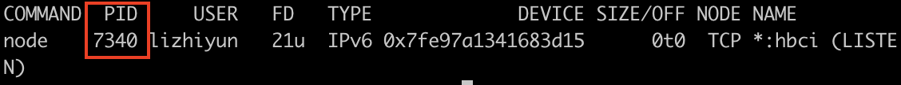

## Dependencies 與 DevDependencies
Dependencies 與 DevDependencies 內都是 npm 安裝的 package，由 terminal 下指令安裝而產生，唯一區別是 Dependencies 內放的是在**執行環境**時也需要的 package， DevDependencies 放的是只有在**開發環境**才需要的 package         
而套件案的安裝可以透過指令控制：       

1. 安裝在 Dependencies（執行環境，如 React 等框架）：      

```
npm install <package_name>
```   

```
npm install --save <package_name>
```   
2. 安裝在 DevDependencies（開發環境）：

```
npm install <package_name> --save-dev
```
```
npm install --only=dev
```


## package.json 中的 scripts 這個區塊怎麼用？
script 是命令腳本，可以在裡面自行編輯 command ，如果專案後期越來越複雜，可以善用script 讓指令長度大幅縮減，增加工作效率！     
格式如下：     
```
"scripts": {
        "script名稱1": "要執行的command",
        "script名稱2": "要執行的command",
        ...
    },
```

## Port number 要怎麼以環境變數來設定？      

1. 先將 app.js 中 port = 3000 寫死的設定改成：     
```
const port = process.env.PORT || 3000;
//讀取環境變數設定的 PORT，如果沒有找到則使用 3000
```      

2. 設定環境變數          
在 terminal 中輸入想要使用的 port 號碼（如：8080）     
```  
PORT=8080 node app.js
```     

### 補充：Port 被佔用時的清理方法      
1. 在 terminal 尋找要使用的 Port 被哪個 Process 佔用：   
```      
lsof -i :<PORT_NUMBER>
```   

2. 出現列表如下：      

       

3. 以 PID kill 執行中的 Process：            
``` 
kill -9 <PID>
```    

4. 或在 terminal 使用 ctrl + c           


## 哪些檔案應該要被放上 github repo?
## require 與 import/export、 CJS vs ESM，這兩者分別怎麼用？
## 補充
