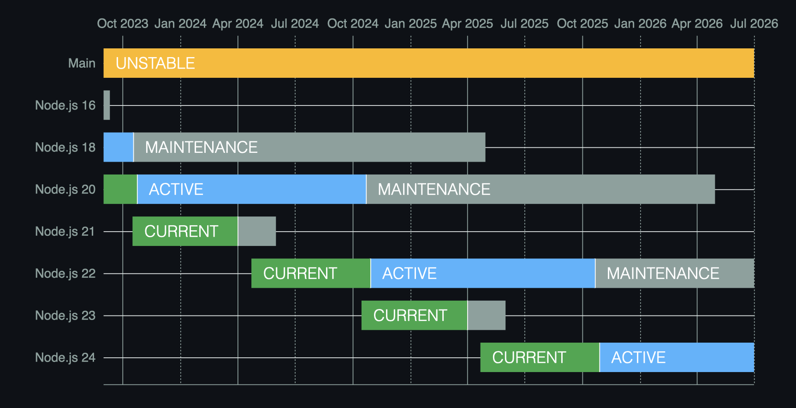

### NodeJS 環境建置 

## NodeJS版本說明    

此次安裝版本為 v18.20.4（LTS），主要原因為 Node.js 的版本在釋出後六個月內皆處於 Current 狀態，讓函數庫作者有時間為其新增支援功能；六個月後，奇數編號的釋出版本會停止支援，而偶數編號的釋出版本會進入活躍 LTS (Active LTS) 狀態，開放一般大眾使用。         
     
LTS 狀態代表「長期支援」，在 30 個月內發現的重大錯誤通常都會得到修復，而本次  安裝的 v18.20.4 目前處於 LTS 且 Maintenance 持續至 2025 年 4 月（參下圖），是目前較新且穩定的版本。

    

