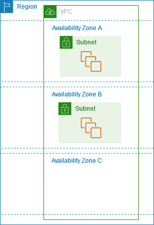
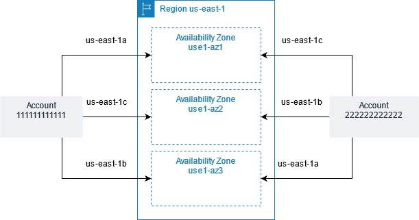

# AWS 帳號註冊      

## 什麼是 AWS Region  

+ Amazon 將服務區域分隔為多個 (Region)，每個區域皆與其他區域隔離，以達到最高的**容錯能力與穩定性**。                   
+ 檢視執行元件時只會看到自己區域的執行元件，而且不會自動跨區域複寫資源。        
+ 啟動執行元件時必須選取 AMI 位於相同區域中的執行元件，如果 AMI 位於另一個區域中，可以將 AMI 其複製到自己的區域。        
（補充：Amazon 機器映像 (AMI) 是提供設定和啟動 Amazon EC2 專案所需軟體的映像檔，每個AMI包含一個區塊裝置對應，指定要連接至您啟動的專案的區塊裝置，必須在啟動執行個體AMI時指定；一個 AMI 包含以下屬性：地區、作業系統、處理器架構、 root 設備類型、虛擬化類型。）             
+ 下表為 AWS 各區域之代碼及手動啟用狀況    

| 代碼            | 地區                         | 手動加入 |
| :------------- | :--------------------------- | :------------ |
| us-east-1      | US East (N. Virginia)         | 不需要  |
| us-east-2      | US East (Ohio)                | 不需要  |
| us-west-1      | US West (N. California)       | 不需要  |
| us-west-2      | US West (Oregon)              | 不需要  |
| af-south-1     | Africa (Cape Town)            | 需要      |
| ap-east-1      | Asia Pacific (Hong Kong)      | 需要      |
| ap-south-2     | Asia Pacific (Hyderabad)      | 需要      |
| ap-southeast-3 | Asia Pacific (Jakarta)        | 需要      |
| ap-southeast-5 | Asia Pacific (Malaysia)       | 需要      |
| ap-southeast-4 | Asia Pacific (Melbourne)      | 需要      |
| ap-south-1     | Asia Pacific (Mumbai)         | 不需要  |
| ap-northeast-3 | Asia Pacific (Osaka)          | 不需要  |
| ap-northeast-2 | Asia Pacific (Seoul)          | 不需要  |
| ap-southeast-1 | Asia Pacific (Singapore)      | 不需要  |
| ap-southeast-2 | Asia Pacific (Sydney)         | 不需要  |
| ap-northeast-1 | Asia Pacific (Tokyo)          | 不需要  |
| ca-central-1   | Canada (Central)              | 不需要  |
| ca-west-1      | Canada West (Calgary)         | 需要      |
| cn-north-1     | China (Beijing)               | 不需要  |
| cn-northwest-1 | China (Ningxia)               | 不需要  |
| eu-central-1   | Europe (Frankfurt)            | 不需要  |
| eu-west-1      | Europe (Ireland)              | 不需要  |
| eu-west-2      | Europe (London)               | 不需要  |
| eu-south-1     | Europe (Milan)                | 需要      |
| eu-west-3      | Europe (Paris)                | 不需要  |
| eu-south-2     | Europe (Spain)                | 需要      |
| eu-north-1     | Europe (Stockholm)            | 不需要  |
| eu-central-2   | Europe (Zurich)               | 需要      |
| il-central-1   | Israel (Tel Aviv)             | 需要      |
| me-south-1     | Middle East (Bahrain)         | 需要      |
| me-central-1   | Middle East (UAE)             | 需要      |
| sa-east-1      | South America (São Paulo)     | 不需要  |

  

## 什麼是 AZ（Available Zone）      

+ 每個 Region 擁有多個隔離位置稱為可用區域（AZ）。         
+ AZ 代碼為其 Region 代碼後續跟著一個字母識別符，例如：us-east-1a。          
+ 啟動執行元件時需進行以下設定：選取區域和虛擬私有雲 (VPC) => 從其中一個 AZ 選取子網路。
+ 如果執行元件分散至多個 AZ，但其中一個執行個體故障，則可以預先設計組態，讓其他 AZ 內的執行元件來處理要求；或者用彈性 IP 地址快速將地址重新映射到另一個可用區域中的執行元件。
+ 下圖說明多個可用區域     
可用區域 A 和可用區域 B 各有一個子網，每個子網都有執行元件。
可用區域 C **沒有子網，因此無法在此可用區域中啟動執行元件**。

        
 
圖片來源：https://docs.aws.amazon.com/zh_tw/AWSEC2/latest/UserGuide/using-regions-availability-zones.html
        
### AZ ID    
+ 以 ID 來區分同一個 Region 下的 AZ，ID 相同不一定代表實體位置一樣，這是為了確保資源分散運用，如下圖：  

        
 
圖片來源：https://docs.aws.amazon.com/zh_tw/AWSEC2/latest/UserGuide/using-regions-availability-zones.html        

+ AZ ID 列表       

| Region                       | Availability Zones                                 |
| :--------------------------- | :------------------------------------------------ |
| 美國東部 (維吉尼亞北部)         | use1-az1, use1-az2, use1-az3, use1-az4, use1-az5, use1-az6 |
| 美國東部 (俄亥俄)              | use2-az1, use2-az2, use2-az3                       |
| 美國西部 (加利佛尼亞北部)       | usw1-az1, usw1-az2, usw1-az3†                       |
| 美國西部 (奧勒岡)              | usw2-az1, usw2-az2, usw2-az3, usw2-az4              |
| 非洲 (開普敦)                  | afs1-az1, afs1-az2, afs1-az3                        |
| 亞太區域 (香港)                | ape1-az1, ape1-az2, ape1-az3                        |
| 亞太區域 (海德拉巴)            | aps2-az1, aps2-az2, aps2-az3                        |
| 亞太區域 (雅加達)              | apse3-az1, apse3-az2, apse3-az3                     |
| 亞太區域 (馬來西亞)            | apse5-az1, apse5-az2, apse5-az3                     |
| 亞太區域 (墨爾本)              | apse4-az1, apse4-az2, apse4-az3                     |
| 亞太區域 (孟買)                | aps1-az1, aps1-az2, aps1-az3                        |
| 亞太區域 (大阪)                | apne3-az1, apne3-az2, apne3-az3                     |
| 亞太區域 (首爾)                | apne2-az1, apne2-az2, apne2-az3, apne2-az4          |
| 亞太區域 (新加坡)              | apse1-az1, apse1-az2, apse1-az3                     |
| 亞太區域 (雪梨)                | apse2-az1, apse2-az2, apse2-az3                     |
| 亞太區域 (東京)                | apne1-az1, apne1-az2, apne1-az3, apne1-az4          |
| 加拿大（中部）                  | cac1-az1, cac1-az2, cac1-az4                        |
| 加拿大西部 (卡加利)            | caw1-az1, caw1-az2, caw1-az3                        |
| 歐洲 (法蘭克福)                | euc1-az1, euc1-az2, euc1-az3                        |
| 歐洲 (愛爾蘭)                  | euw1-az1, euw1-az2, euw1-az3                        |
| 歐洲 (倫敦)                    | euw2-az1, euw2-az2, euw2-az3                        |
| 歐洲 (米蘭)                    | eus1-az1, eus1-az2, eus1-az3                        |
| 歐洲 (巴黎)                    | euw3-az1, euw3-az2, euw3-az3                        |
| 歐洲 (西班牙)                  | eus2-az1, eus2-az2, eus2-az3                        |
| 歐洲 (斯德哥爾摩)              | eun1-az1, eun1-az2, eun1-az3                        |
| 歐洲 (蘇黎世)                  | euc2-az1, euc2-az2, euc2-az3                        |
| 以色列（特拉維夫）              | ilc1-az1, ilc1-az2, ilc1-az3                        |
| 中東（巴林）                    | mes1-az1, mes1-az2, mes1-az3                        |
| 中東 (UAE)                     | mec1-az1, mec1-az2, mec1-az3                        |
| 南美洲（聖保羅）                | sae1-az1, sae1-az2, sae1-az3                        |
| AWS GovCloud (美國東部)        | usge1-az1, usge1-az2, usge1-az3                      |
| AWS GovCloud (美國西部)        | usgw1-az1, usgw1-az2, usgw1-az3                      |

## Region 選擇      
選擇 AWS Region 考量的點有（依重要程度排序）：   
1. 法律規範：某些數據可能法律規定需要在特定地區存儲數據（如：金融數據），確認所選 Region 符合法規。         
2. 服務項目：不同區域支援的 AWS 服務不同，某些功能或服務可能會在特定 Region 優先推出，先確認所需的服務在該 Region 內可用再選擇。       
3. 地理位置：要考到慮網絡延遲的影響，選擇靠近用戶或客戶的區域以降低延遲、提高效能。       
4. 容錯性：某些 Regions 有多個 AZs ，可以配合系統架構設計，提高系統容錯率。       

