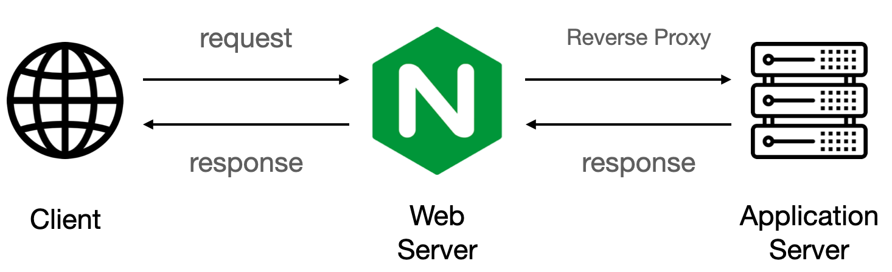
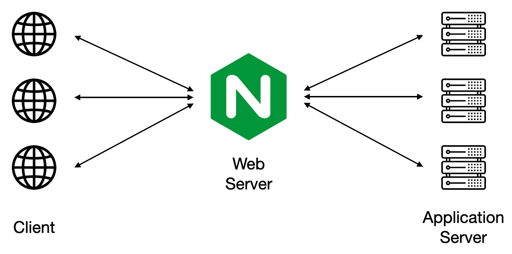
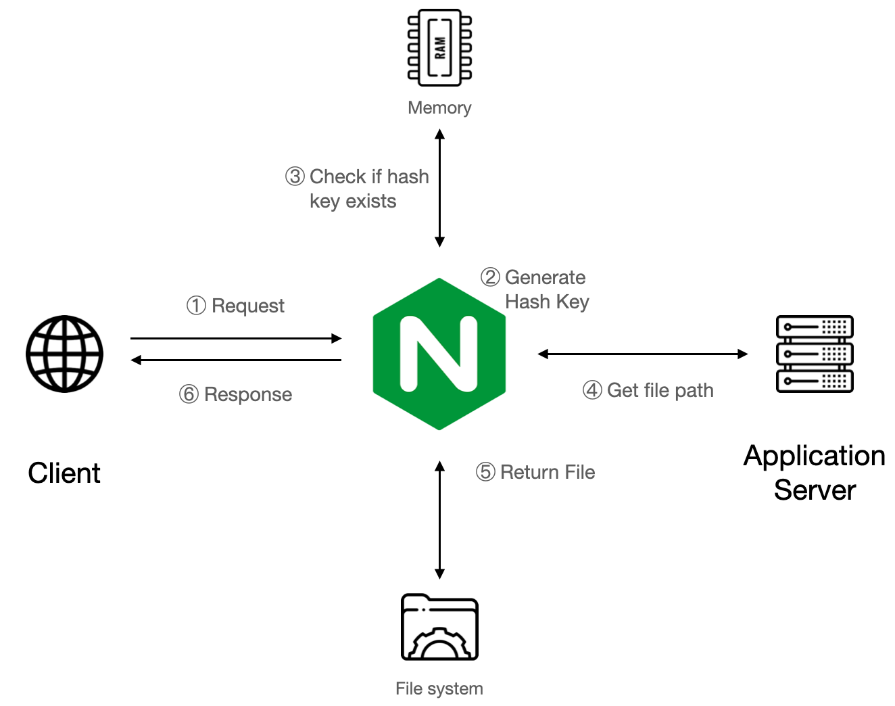
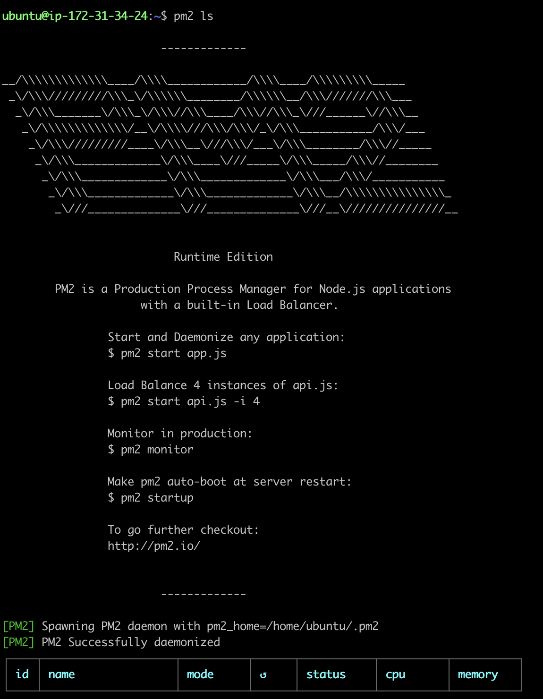
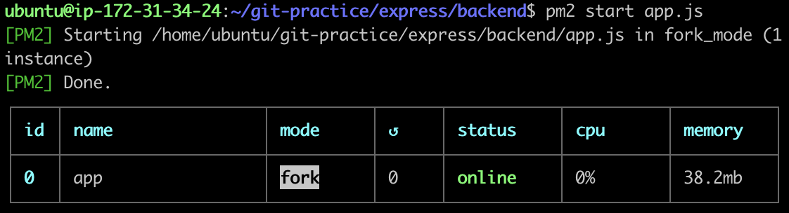
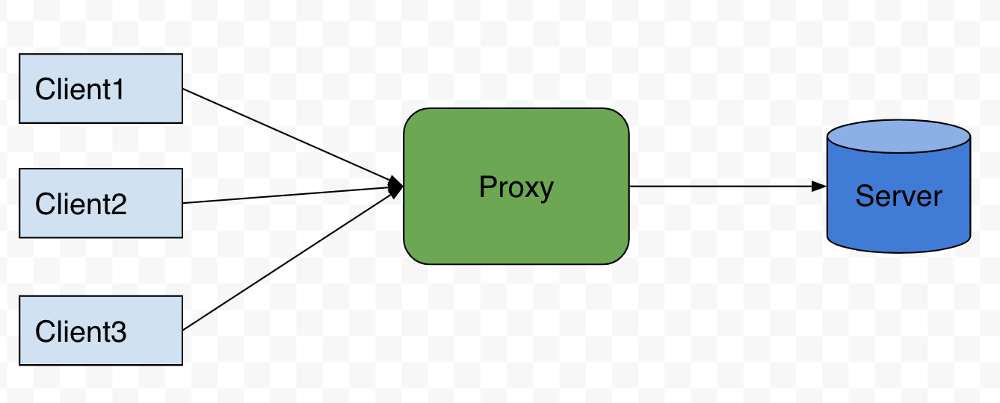
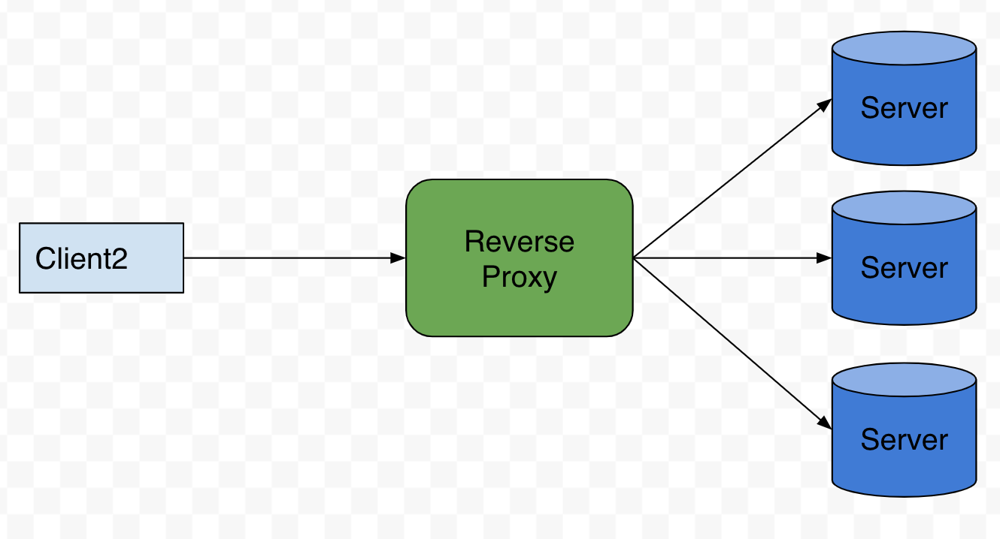
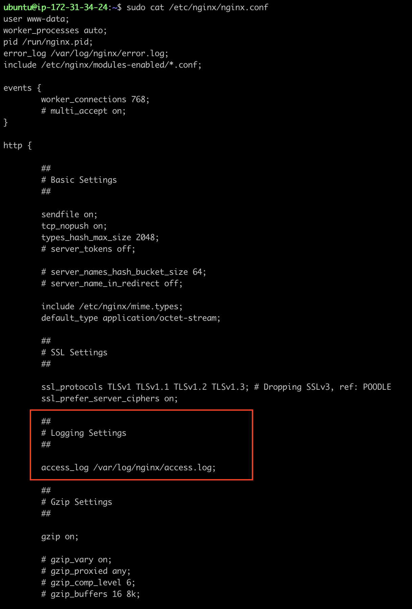
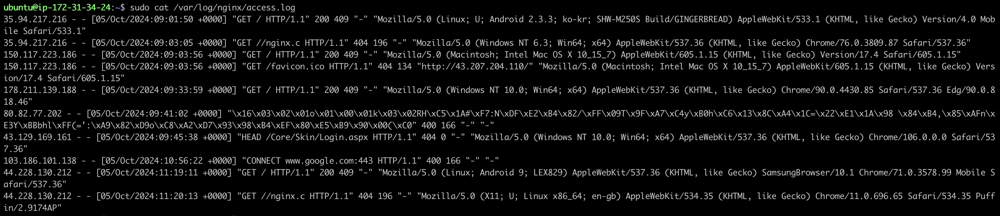

# 問題討論
## 1.  instance 的 public IP            
http://43.207.204.110           

## 2. 什麼是 instance type?           
###  - 說明
不同的開發專案擁有不同的需求、目標、預算，因此需要各式各樣的資源組合（如：CPU、記憶體、儲存體和網路流量）來支援，instance type 即是不同的資源組合，AWS 依據各項資源組合特點將 instance type 分為以下大類：

| **類別** | **適用** |  
|------------------------|----------|  
| 一般用途               | 可用於各種一般工作，如 Web 伺服器和程式碼儲存庫 |  
| 運算優化               | 適合運算密集型應用程式，如：batch、高效能 Web 伺服器、高效能運算 (HPC)、遊戲 Server |  
| 記憶體優化             | 針對記憶體密集型工作，加速記憶體內處理大型資料集 |  
| 加速運算               | 使用硬體加速器或協同處理器執行函數 （例如，浮點數計算、圖形處理或資料模式比對），比在 CPU 上執行更有效率（用 GPU） |  
| 儲存優化               | 專為需要對本機上的 Hyperscale Data Center 進行高速且連續的讀取寫入工作設計，低延遲 |  
| HPC 優化               | 適合大規模執行 HPC 工作，如：複雜模擬和深度學習 |  
    

###  - 如何選擇？
1. 比較不同的 instance type 系列，確定應用程式需求
2. 調整工作負載以選擇最佳 instance type ，評估應用程式效能、執行應用程式測試。

## 3. 什麼是 Nginx？有哪些用途與特性？    
###  - 用途說明                 
Nginx 是一款開源的網路伺服器，能夠用於多種網路服務，最主要的功能是作為網頁伺服器，處理來自網路的 HTTP 請求；也常常被使用為反向代理伺服器，提升網站的效能以及提供更高的靈活度，此外，Nginx 也能提供 load balance 的服務，以及郵件伺服器。                      

###  - Nginx 特性           
| **特性** | **說明** |  
|------------------------|----------|  
| 基礎性能| Nginx 特點為事件驅動架構與 non-blocking I/O，能夠更好地處理高流量 |        
| 配置和管理| 配置文件簡潔直觀（與 Apache 相比） |        
| 模塊和靈活性| 提供 module 功能，但必須在 compile 的時候就載入，無法動態載入|               
| 對 PHP 的支援| Nginx 可以通過 FastCGI 來處理 PHP，但需自行配置 |  
|反向代理| Client 與 Server 不需知道彼此真實位址，僅需要透過 Nginx 反向代理即可達成請求       圖片來源：https://www.explainthis.io/zh-hant/swe/why-nginx|   
|負載均衡 |Nginx 能夠自動的將 Request 分送到不同 Server 上，而分送的演算法可以自己設計，最常使用的是 RR         圖片來源：https://www.explainthis.io/zh-hant/swe/why-nginx|  
|HTTP 快取|Nginx 會利用 http 快取的機制做優化，提高效能     圖片來源：https://www.explainthis.io/zh-hant/swe/why-nginx|

補充：              
事件驅動架構（EDA）: 一種軟體架構模式，其中系統的行為主要是對發生的事件做出反應，在事件驅動架構中，系統的各個元件彼此之間通過發送和接收事件來進行溝通和協作，而不是直接互相調用；事件驅動架構通常包含三個主要元件：生產者（Producer）、事件代理（Event Broker）和訂閱者（Subscriber）。             

## 4. 關於 pm2 套件  

### pm2 套件是什麼？
pm2 的 pm 是 Process Manager 的意思，此套件適用在虛擬主機上，用來管理程式，pm2 可以設定 process 自動重啟、在儲存時重啟、亦或是開機自動啟動等。

### 相關指令            
1. 列出 process             
```
pm2 ls
```
     

2. 啟動 process                 
（由於想啟動的是 express 專案，所以要先切到專案目錄，即/git-practice/express/backend/）             
```
pm2 start app.js
```
            

3. 開機自動執行 pm2
```
pm2 startup
```
將 startup 指令寫入
```
sudo env PATH=$PATH:/usr/bin /usr/local/lib/node_modules/pm2/bin/pm2 startup systemd -u ubuntu --hp /home/ubuntu
```
儲存設定

```
pm2 save
```

## 5. `proxy` 相關      
### 何謂 proxy          
 一般指代理伺服器，允許 server 端與 client 端進行非直接的連接，Gateway、Router 等網路裝置就具備此功能； proxy 有利於保障網路終端的隱私或安全，在一定程度上能夠阻止網路攻擊。

###  透過 Nginx 來 代理 Express 專案        
在前面有提到，Nginx 可以實現反向代理（參3. 什麼是 Nginx？有哪些用途與特性？），因此可達到下列好處：         

1. Load balance： Reverse Proxy 可以分配 server 去處理請求，控制流量       
2. Caching：暫存加快需求處理            
3. 彈性高：若要新增功能、需求，或是改變 port，只要將 server 端連上 proxy 即可

補充：正向代理與反向代理
- 反向代理（Reverse proxy）是 proxy 的一種，根據 client 的請求從 proxy server 上取得資源，然後再將這些資源返回給 client；而正向代理（Forward Proxy）則是作為一個中繼，將 server 資源傳給眾多 client，server不知道發請求的 client 是哪一個。        

- 反向代理是在 server 端作為代理使用，而不是 client 端，client 端通過正向代理可以存取很多不同的資源，而反向代理是眾多 client 都通過它存取不同後端伺服器上的資源，而不需要知道這些後端伺服器的存在，就像所有資源都來自於這個 Reverse proxy Server，client 不知道背後服務的 server 是誰。             

- 圖例

  
  
圖片來源：https://www.jyt0532.com/2019/11/18/proxy-reverse-proxy/


## 6. 在 readme 中提供步驟 9 的 Nginx 設定檔    

輸入以下指令：
```
sudo nano /etc/nginx/sites-available/default
```         

出現設定檔內容如下(已刪除多餘註解)：
```
server {
        listen 80 default_server;
        listen [::]:80 default_server;
        # 預設是 listen to port:80

        server_name _;

        location / {
                proxy_pass http://localhost:3000;
                # 將 port:3000 上的專案導到 proxy (Nginx 管理)上，再由 proxy 提供給client

                proxy_http_version 1.1;
                # 指定Nginx在向後端伺服器發送代理請求時，使用HTTP 1.1協議

                proxy_set_header Upgrade $http_upgrade;
                # 用於升級協議

                proxy_set_header Connection 'upgrade';
                # 將Connection標頭設置為upgrade

                proxy_set_header Host $host;
                # 這一行將 Host 標頭設置為 $host 變量，該變量代表 client 請求中的 Host 值

                proxy_cache_bypass $http_upgrade;
                # 如果請求包含 Upgrade 標頭，則跳過 proxy
                
                try_files $uri $uri/ =404;
                # 如果連不到就回 404
        }

```


## 7. Security Group 是什麼？用途為何？有什麼設定原則嗎？       
### Security Group 用途         
Security Group 主要用途是設定伺服器的連線方式，如一個虛擬防火牆，控制允許取用和離開 instance 的流量，Security Group 可以單獨設定規則如：特定 IP、port 號和 protocal 類別，設定完成後供 instance 取用。       

### 相關設定原則      
1. 只定義允許的規則：Security Group 只允許指定的流量，任何未被允許的流量都會被默認拒絕。            
2. 默認拒絕一切流量：除非明確允許，否則所有入站出站流量都會被拒絕。               
3. Principle of Least Privilege：只允許必要的端口和IP範圍，**避免允許0.0.0.0/0**。                      
4. 進出流量分開設置： 應根據應用的需求設置不同的入站和出站規則。
5. 定期審查和更新規則。         
6. 不同使用案例的安全群組規則也不同，可參考 aws 官網            
https://docs.aws.amazon.com/zh_tw/AWSEC2/latest/UserGuide/security-group-rules-reference.html#sg-rules-web-server


## 8. 關於 sudo         
### 何為 sudo？
Super User DO，是 Unix / Linux 平臺上的一個工具，如果在終端輸入一個命令前加上 sudo 系統就能讓一般用戶執行一些只有系統管理員或其他特定帳號才能完成的任務，例如：執行 mount, halt, su 這類的指令，或者編輯系統設定檔 (如：.conf 等)，如此減少了 root 使用者的登錄次數和管理時間，也提高系統安全性，sudo 指令特性如下：            

| **特性** | **說明** |  
|------------------------|----------|  
| 提高權限執行命令 | 讓普通用戶執行需要高級權限的命令 | 
|安全控制|系統管理員可以配置哪些用戶可以使用 sudo，以及相關命令|
|日誌記錄|所有使用 sudo 的命令都會被記錄在日誌中，方便追踪|
|密碼驗證|使用 sudo 時，系統會提示輸入當前用戶密碼以確認身份|

### 使用情境            

1. 安裝特定套件時（如：pm2）   
```
sudo apt install pm2
```

2. 編輯系統文件（如：nginx.conf）
```
sudo nano /etc/nginx/nginx.conf
```
- nano：一個用於終端的編輯器，常見於 Linux 和 Unix 系統中，專為那些不熟悉複雜編輯器（如 vim 或 emacs）的用戶設計，提供了友好的操作介面和簡單的快捷鍵操作（但是我還是覺得有點難用><）。            
（註：在修改 nginx/sites-available/default 檔案時曾有想用 FileZilla 下載文字檔修改再丟回去，但是一樣遇到權限問題，一定要使用 sudo command 修改 0.0）                          

3. 重啟系統服務（如：Nginx）
```
sudo systemctl restart nginx
```

### 補充
- sudo v.s. su      
sudo 是代為執行高權限任務， su 後面通常會接 root ，直接切換到管理員。
        

## 9. 關於 Nginx 的 Log 檔               
### Log 檔路徑  
1. 訪問日誌             
```
/var/log/nginx/access.log
```
2. 錯誤日誌       
```
/var/log/nginx/error.log
```  
### 尋找 Log 檔路徑             
輸入以下指令檢查 Nginx 的主配置檔：      
```
sudo cat /etc/nginx/nginx.conf
```
出現資訊：
    
（由於尚未有 error 因此無 error.log）             

### 查看 Log 檔路
輸入以下指令查看：      
```
sudo cat /var/log/nginx/access.log
sudo cat /var/log/nginx/error.log
```
出現資訊：


```
35.94.217.216 - - [05/Oct/2024:09:01:50 +0000] "GET / HTTP/1.1" 200 409 
#為訪問的 IP   - - [時間] "Method / 連線方式與version"  Http 狀態碼 回應字節數

"-" "Mozilla/5.0 (Linux; U; Android 2.3.3; ko-kr; SHW-M250S Build/GINGERBREAD) AppleWebKit/533.1 (KHTML, like Gecko) Version/4.0 Mobile Safari/533.1"
# 發起請求的客戶端信息（OS ,設備, broswer）
```

## 10. 問題補充             
### 設定 Express 專案 proxy 到 NiginX 之 port 問題          
目前在 Nginx 設定檔中的內容是將 port:3000 上的專案（Express Default）導到 proxy 上，而 server listen to port:80；但是 Express 專案未必每次都會以 port:3000 啟動，結合前一週的 port 動態設定問題提出以下兩解方：             

1. 在啟動專案的時候指定  port:3000          
在啟動 express 專案時加上 port 號
```
PORT=3000 node app.js
```
或使用 pm2 固定 port
```
pm2 start app.js --name "my-express-app" --watch -- 3000
```
此方法缺點是要先關閉佔用 port:3000 的 process ，且要記得使用的 port 是 3000         
不過可以用以下指令查詢正在監聽的 port：           
```
sudo lsof -i -P -n | grep LISTEN
```       

2. 設定 Nginx 使用動態代理端口
配置一連串的 port 號讓 server 根據哪個 port 正在運行來進行代理。            
```
upstream myapp {
    server 127.0.0.1:3000;
    server 127.0.0.1:3001;
    server 127.0.0.1:3002;
    #設定多個 port：3000, 3001, 3002
}

server {
    listen 80;
    server_name yourdomain.com;

    location / {
        proxy_pass http://myapp;
        # 取用 upstream 設定，哪個 port 在運行就會被代理

        proxy_set_header Host $host;
        proxy_set_header X-Real-IP $remote_addr;
        proxy_set_header X-Forwarded-For $proxy_add_x_forwarded_for;
        proxy_set_header X-Forwarded-Proto $scheme;
    }
}
```
但是這樣是不是要設定很多個 port ?       
如果還是 miss 掉怎麼辦 0.0          
目前只想到這裡...                       


## 11. 參考資料           
1. 在 Ubuntu 22.04 安裝 Nginx 網頁伺服器，並架設多個網站（多網域）              
網址：https://ui-code.com/archives/667#google_vignette        

2. Stackoverflow        
網址：https://stackoverflow.com/questions/31476232/node-js-server-listening-on-port-3000-but-i-cant-view-it-in-browser       
3. 使用 pm2 管理 Node.js 服務           
網址：https://noob.tw/pm2/       

4. 前端壹兩三事                
網址： https://medium.com/前端壹兩三事/聊聊關於基本的-nginx-reverse-proxies-and-nodejs-express-web-server-2a1c8e7e7de1          
5. 波波的前後端隨筆         
網址：https://lidemy5thwbc.coderbridge.io/2021/09/09/ngix/      

6. ChatGPT

7. Nginx 是什麼？認識 Web Server 與 Nginx 入門教學                   
網址：https://tw.alphacamp.co/blog/nginx

8. Nginx 是什麼？有哪些用途？                
網址：https://www.explainthis.io/zh-hant/swe/why-nginx   

9. jyt0532's Blog           
網址：https://www.jyt0532.com/2019/11/18/proxy-reverse-proxy/

10. AWS 官網            
網址：https://docs.aws.amazon.com/zh_tw/vpc/latest/userguide/security-group-rules.html


## 12. Linux 環境             
-  /etc：系統配置、服務配置、系統初始化腳本、用戶和群組信息   
-  /var：日誌文件、郵件、數據庫、PID 文件        
-  /boot：啟動載入器文件、開機時會用到的內核映像、初始化內存映像             


- $PATH 環境變數         
一個包含多個目錄的列表，用以簡化命令執行，只需要輸入命令名，系統就會自動在 $PATH 中的目錄中查找該命令並執行。              
```
echo $PATH
# 查看當前的 $PATH
```
  
- which     
用來查找可執行命令的絕對路徑，會根據 $PATH 環境變數所指定的目錄去搜尋命令，並顯示該命令的具體路徑。        
```
which 命令名稱
```
