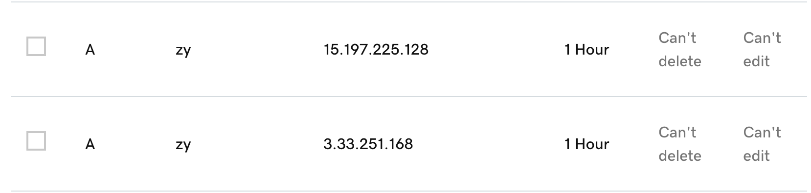
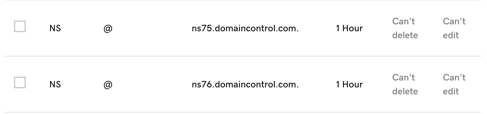

## 1. 網址       
https://papperhelper.xyz                
https://zy.papperhelper.xyz/        

註：設定子網域直接設 A record 就好，不要設 forward，不然憑證會失效                                 

## 2. 網域購買           
小組統一購買，是由 GoDaddy 提供的網域。                                       
主要 domain name 是 papperhelper.xyz ，各組員的子網域則是在 domain name 前加上名字如： zy.              papperhelper.xyz。                                                 

## 3. DNS 的 A record 是什麼？
A -> address ，是最基礎的 DNS 記錄類型，表示給定網域的 IP 位址。                    
A 記錄只會保留 IPv4 位址，如果網站有 IPv6 位址，它將改為使用「AAAA」記錄。          
自己網域的 A record ：              
       

## 4. DNS 的 NS record 是什麼？
名稱伺服器，名稱伺服器記錄指向哪個 DNS 伺服器對該網域具有權威性，即可從該伺服器找到網域的 IP 位址，一個網域通常會有多個 NS 記錄，這些記錄可指示該網域的主要和次要名稱伺服器。               
自己網域的 NS record ：         

## 5. Domain Name vs FQDN vs URL 這三者分別為何？

### Domain Name
網域或伺服器的名字，通常連結 IP 位址，讓使用者更容易記住和訪問網站， Domain Name 只是網站的名稱，不包含任何路徑或協議。

### FQDN
完整領域名稱（Fully qualified domain name），是 Domain Name 的一種，指定網路上某個具體裝置的唯一位置，通常是實體的主機或伺服器，一個完整的 FQDN 會包含各階層的域名。

### URL
全名是 Uniform Resource Locator，也就是網址，是一個完整的資源地址，包含了訪問資源所需的所有信息，包括協議、域名和路徑。

## 6. 為什麼應該要為網站加上憑證？而不是直接用 http 就好？          
網站加上憑證的理由及好處如下：      
1. 資料加密：
HTTP 是明文傳輸，數據在傳輸過程中可以被攔截，任何人都能查看傳輸的信息；HTTPS 在傳輸時能夠透過加密保護用戶的隱私，即便數據被攔截也無法讀取其中的內容。

2. 資料完整性：
HTTP 無法保證傳輸中的資料不被篡改，但HTTPS 能保證數據的完整性，傳輸過程中的任何篡改行為都能被偵測到，避免用戶收到被改動的資料（中間人攻擊）。

3. 身份驗證：
HTTP 無法驗證伺服器的真實身份，可能會有進入釣魚網站的風險，加入 HTTPS 可以讓使用者知道該網站是合法的，提升使用者信任。

4. SEO 排名提升：
在搜尋引擎如 Google 上，有 HTTPS 加密的網站會比未加密的在搜尋結果中更優先被顯示，有助於增加網站的曝光度和流量。
