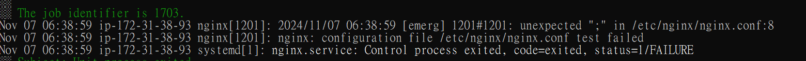
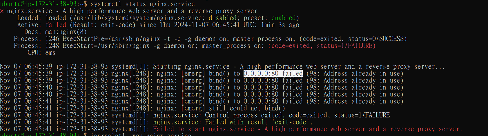

# RAC (root cause analysis)
##  問題一              
- 如何發現：進入 instance 看 error.log，發現 log 顯示第 8 行有誤       
    
       
- 如何解決：進入 nginx 設定檔，發現第 8 行多一個「；」，刪掉存擋，重啟 nginx。

##  問題二      
- 如何發現：修完問題一後發現 log 顯示 port 80 被佔用               
       

- 如何解決： kill port 80 執行中的程序

