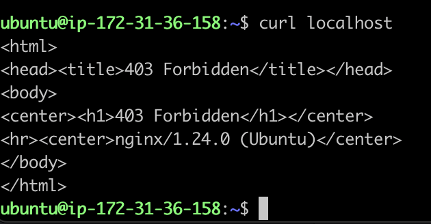

# RAC (root cause analysis)
##  問題一              
- 如何發現：進入 instance 看 error.log，發現 log 顯示第 8 行有誤       
    
       
- 如何解決：進入 nginx 設定檔，發現第 8 行多一個「；」，刪掉存擋，重啟 nginx。


##  問題二      
- 如何發現：修完問題一後發現 log 顯示 port 80 被佔用               
       

- 如何解決： kill port 80 執行中的程序。        

## 問題三
- 如何發現：kill 完之後發現無法連到 port 80，但是 port 80 沒有執行中的程序，查看防火牆後發現規則無法允許 port 80 通過。             
```
ls -ld /etc/iptables
```
出現以下規則：
```
Chain INPUT (policy ACCEPT)
target     prot opt source               destination
ACCEPT     tcp  --  anywhere             anywhere             tcp dpt:http
ACCEPT     tcp  --  anywhere             anywhere             tcp dpt:http

Chain FORWARD (policy ACCEPT)
target     prot opt source               destination

Chain OUTPUT (policy ACCEPT)
target     prot opt source               destination
```

- 如何解決：修改防火牆，步驟如下：      

1. 添加允許 port 80 通過的規則：
```
sudo iptables -A INPUT -p tcp --dport 80 -j ACCEPT
```

2. 刪除 Reject 規則
```
sudo iptables -D INPUT -p tcp --dport 80 -j REJECT
```
3. 保存規則     
```
sudo iptables-save > /etc/iptables/rules.v4

```
4. 重啟 nginx   

## 問題四
- 如何發現：curl localhost 出現以下內容：
       

- 如何解決：頁面 403 表示資源的訪問權限不足，經查是 html 檔案沒有 read 權限，執行以下指令重寫權限：
```
sudo chmod 644 /var/myweb/index.html
```

## 即可正常運作


